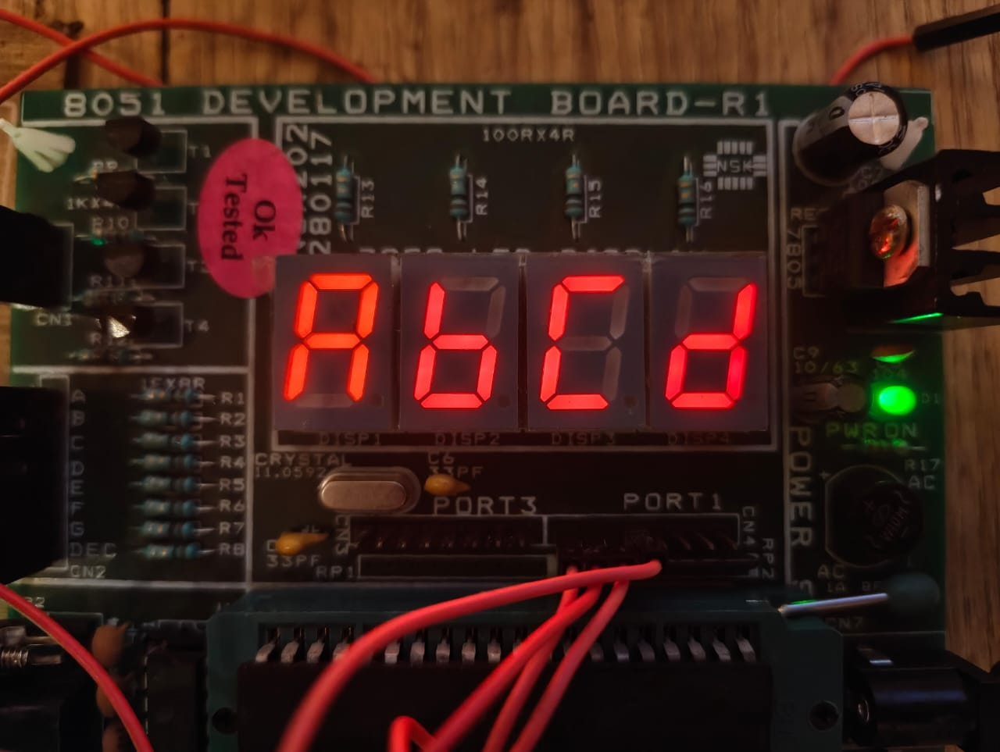

## How to use 7_seg.h ?

```c
// Iitalize the Display Config in this format
Seg_config_t Display = {
        .Segment_Port = PORT_0, // port used by the 7 segment pins aka (GPIOS for individual segments)
        .Seg_Enable_Port = PORT_1, // this is used if you have multiple 7 segment displays
        .Seg_Enable_Pins = {PIN_7, PIN_6, PIN_5, PIN_4}
    };

    Segment_Init(&Display); // initalize the dislay config
    
    while (1)
    {   
        
        Multi_Segment_write_Digits(&Display, 1234); // can be used for multiple segments as well as single
        
        Segment_Write_char(&Display, "1B9D"); // used to write character values
       
    }
```

## Result
<div align="center"> 
</div>
<div align="center"> 
</div>
