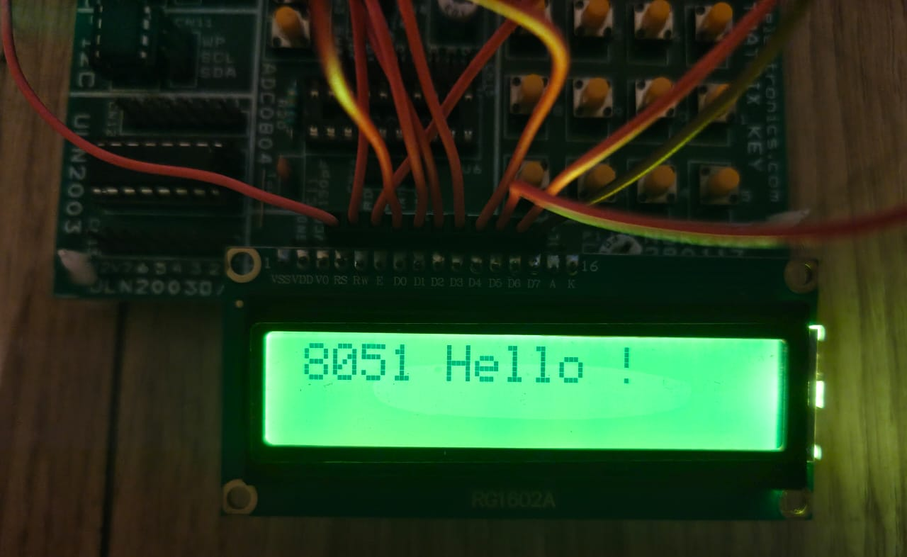

## How to used LCD16X2.h ?

```c
void main(){
    unsigned char s[13] = "8051 Hello !"; // str to be printed
    // define the connection of the lcd to the 8051
    LCD_Config_t lcd = {
        .Data_Port = PORT_0, // port 0 selected as Data bus
        .Command_Port = PORT_1, // port 1 selecetd as control bus
        .RW = PIN_6,  // respective pins as per lcd
        .RS = PIN_5,
        .EN = PIN_7
    };

    LCD_Init(&lcd); // initalize the lcd configurations
    LCD_Write_Str(&lcd, s); // write the string to the lcd
    while (1)
    {
        
        
    }
    
}
```

## Result
<div align="center"> 
</div>

