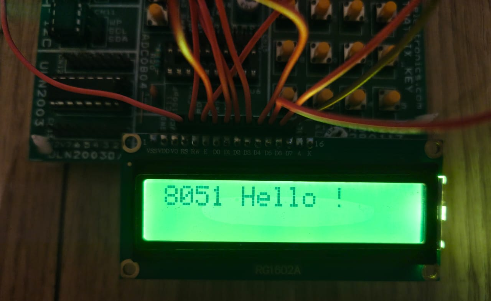

# 8051 HAL (Hardware Abstraction Layer)

This repository is a modular, organized 8051 embedded development environment featuring reusable Hardware Abstraction Layer (HAL) modules, examples, and a helper script for project creation. It is designed for 8051 development with `Makefile`-based builds and easy-to-use structure.

---

## 🔧 Hardware Abstraction Layer (HAL)

The `HAL/` directory contains platform-agnostic drivers for various peripherals. These modules abstract the low-level hardware details, making the code portable and reusable.

### Available HAL Modules

- **GPIO** – Basic GPIO abstraction
- **UART** – Serial communication
- **SysTick** – System tick timer for delays and scheduling
- **Keypad** – 4x4 keypad input support
- **LCD16X2** – HD44780-based character LCD interface
- **7 Segment Display** – Multi-digit display support
- **Button** – Debounced button input

You can include these HAL modules in your custom projects or use the existing examples as templates.

---


## 🧪 Example Projects

The repository includes fully functional examples showcasing how to use different HAL modules:

| Example Directory       | Description                        | Example Output                         |
|-------------------------|------------------------------------|----------------------------------------|
| `blinky/`               | Basic GPIO toggling                |     |
| `button/`               | Reading button inputs              |     |
| `Keypad/`               | Using 4x4 keypad with HAL          |     |
| `LCD16X2/`              | Printing on a character LCD        |       |
| `7_Segment_Display/`    | Driving a 7-segment display        |     |
| `Sys_tick/`             | Demonstrates SysTick usage         |   |
| `Scheduler/`            | Scheduling 4 Tasks Keypad, Display, Led and Uart       |    |
| `Uart/`                 | UART send/receive functionality    |         |

---

## 📁 Project Structure

```
├── HAL/              # Hardware Abstraction Layer modules
├── Assets/           # Shared assets like images or schematics
├── Template/         # Barebones project structure for new projects
├── Create_Prj.sh     # Shell script to auto-generate new project
├── .vscode/          # VSCode-specific config for build and debug
├── README.md         # This file
```

---

## 🛠️ Makefile Commands

All projects support `make`-based workflows:

| Command     | Description                              |
|-------------|------------------------------------------|
| `make`      | Builds the project                       |
| `make flash`| Uploads the binary to the 8051 via USBasp |
| `make clean`| Removes all build artifacts              |

Make sure you have the required toolchain `sdcc` and `Avrdude` installed.

---

## ⚙️ Create New Project

Use the `Create_Prj.sh` script to generate a new project:

```bash
./Create_Prj.sh <ProjectName>
```

This will:
- Create a new folder with the given name
- Setup a working Makefile

---

## 📌 Requirements

- `sdcc`
- `Avrdude`
- Make
- VSCode (recommended, for `.vscode/` integration)

---

## 🧭 Getting Started

1. Clone the repo.
2. Run `./Create_Prj.sh MyProject`
3. Add your source code inside `MyProject/`
4. Run `make` to build
5. Run `make flash` to upload