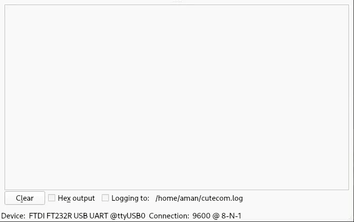

## How to Schedule Task in 8051 ?

```c
#include <8051.h> // BSP defs

// Peripheral Libs
#include "GPIO.h"
#include "Uart.h"
#include "7_Seg.h"
#include "Keypad.h"

#include "Sys_tick.h" // Required for Scheduling


// Define the Time execution frequency lower the number higher the freq
#define TASK_1_Interval 10
#define TASK_2_Interval 100
#define TASK_3_Interval 500
#define TASK_4_Interval 100

// Time watcher of Tasks
unsigned long int Task_1 = 0;
unsigned long int Task_2 = 0;
unsigned long int Task_3 = 0;
unsigned long int Task_4 = 0;

// Tasks Functions
void display_Task(Seg_config_t *config, int *number){
    static int valid_number;
    if(*number != 0xFF){
        valid_number = *number;
    }
    Multi_Segment_write_Digits(config, valid_number);
    
}

void keypad_Task(Keypad_config_t *config, int *number){
    Keypad_Read(config, number);
}

void led_Task(GPIO_Config_t *config){
    static unsigned char val = 1;

    if(val == (1 << 7)){
        val = 1;
    }

    GPIO_PORT_Write(config, ~val);
    val = val << 1;
    
}

void Uart_task(char *Buffer){
    Uart_Send_Str(Buffer);
}


void main(){

    // Nessary Vars for functionality of Tasks
    int count;
    __code char T_2[] = "[Task 2] Button Pressed\n";
    __code char T_3[] = "This is Task 3\n";
    __code char T_4[] = "This is Uart Task\n";

    // Peripheral Configutrations Refer the Peripheral Respective Documentaion / Examples
    Seg_config_t Display = {
        .Segment_Port = PORT_1,
        .Seg_Enable_Port = PORT_3,
        .Seg_Enable_Pins = {PIN_3, PIN_4, PIN_5, PIN_6}
    };

    Keypad_config_t Pad = {
        .ROW_Port = PORT_0,
        .COL_Port = PORT_0,
        .R1 = PIN_4,
        .R2 = PIN_5,
        .R3 = PIN_6,
        .R4 = PIN_7,
        .C1 = PIN_0,
        .C2 = PIN_1,
        .C3 = PIN_2,
        .C4 = PIN_3
    };

    GPIO_Config_t led_array = {
        .Port = PORT_2,
        .Pin = PIN_2,
        .Mode = GPIO_OUTPUT
    };

    Segment_Init(&Display);
    Keypad_Init(&Pad);
    Uart_Init(BAUD_9600);

    Sys_Tick_Init(); // After Setting all Peripheral call systick to get sys_tick_ms 
    while (1)
    {   
        // calling functions according to the frequency defined above
        if( (sys_tick_ms - Task_1) > TASK_1_Interval){
            display_Task(&Display, &count);
            Task_1 = sys_tick_ms;
        }
        
        if((sys_tick_ms - Task_2) > TASK_2_Interval){
            keypad_Task(&Pad, &count);
            if(count != 0xFF){
                Uart_task(T_2);
            } 
            Task_2 = sys_tick_ms;

        }

        if((sys_tick_ms - Task_3) > TASK_3_Interval){
            led_Task(&led_array);
            Uart_task(T_3);
            Task_3 = sys_tick_ms;

        }

        if((sys_tick_ms - Task_4) > TASK_4_Interval){
            Uart_task(T_4);
            Task_4 = sys_tick_ms;

        }
       
    }
    
}

```

## Result
<div align="center"> 
<div align="center"> 
</div>

